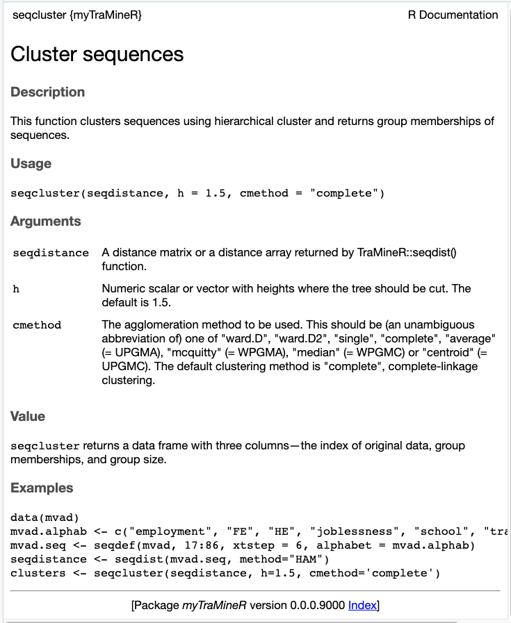
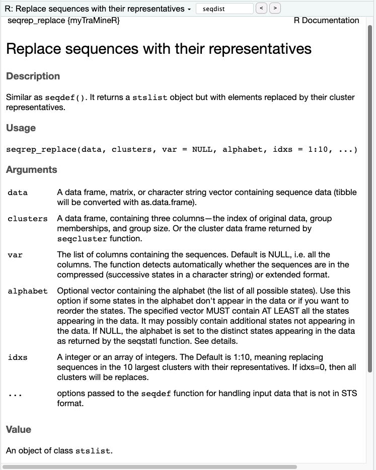
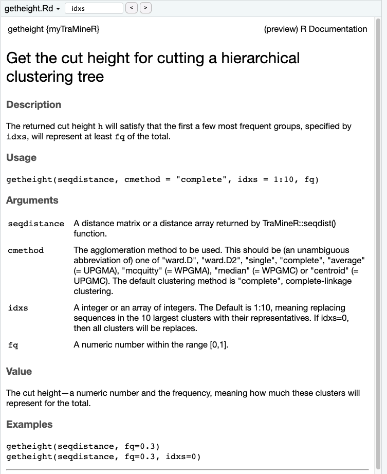

```{r setup, message=FALSE}
# install.packages("myTraMineR", repos = NULL, type="source")
library(myTraMineR)
library(TraMineR)
data(mvad)
mvad.alphab <- c("employment", "FE", "HE", "joblessness", "school", "training")
mvad.seq <- seqdef(mvad, 17:86, xtstep = 6, alphabet = mvad.alphab)
```

```{r fqp1, fig.cap="Frequence plot"}
seqfplot(mvad.seq, idxs = 1:20)
```

Figure 1 shows that the first 20 most frequent sequences represent 27.1% of the total. Now, let's consider a situation: if a sequence differs by only one state from the most common sequence, which consists solely of the "employment" state, this sequence won't be shown in the plot. The difference may be caused by noise, so we are interested in plotting this sequence in the frequency plot as well. In other words, we would like to replace sequences with their representatives and then draw a frequency plot.

# Function 1:  The Extension of `seqfplot()` 
Figure 2 shows that if we consider two sequences different by one Hamming distance as the same, the first 20 most frequent sequences represent 31.6% of the total. This number increased by 16.6% compared to Figure 1.

```{r e_seqfplot, fig.cap="We clustered the first 20 most frequent sequences, found the representative for each cluster, used these representatives to replace every element in the clusters, and then made a frequency plot.", results='hide', message=FALSE}
seqdistance <- seqdist(mvad.seq, method="HAM")
clusters <- seqcluster(seqdistance, h=1.5, cmethod='complete')
alphabet <- c("employment", "FE", "HE", "joblessness", "school", "training")
mvad.new.seq <- seqrep_replace(mvad, clusters, var=17:86, alphabet, idxs=1:20, xtsetp=6)
seqfplot(mvad.new.seq, idxs=1:20)
```

1. `seqdist()` is used to calculate distance matrix using Hamming distance. This is already in `TraMineR`. 
2. `seqcluster()` uses complete linkage clustering and returns a data frame containing cluster information. There are three columns in the returned data frame—index, cluster, and Freq. It shows which cluster a data point belongs to and the cluster size.
3. `seqrep_replace()` is similar as `seqdef()`. It returns a `stslist` object but with elements replaced by their cluster representatives.

Use `help()` to check the usage of these two functions.





# Function2: Get the cut height

`getheight()` returns the cut height for cutting a hierarchical clustering tree. The returned cut height `h` will satisfy that the first a few most frequent groups, specified by `idxs`, will represent at least `fq` of the total.

```{r getheight}
getheight(seqdistance, fq=0.3)
getheight(seqdistance, fq=0.3, idxs=1:100)
```

